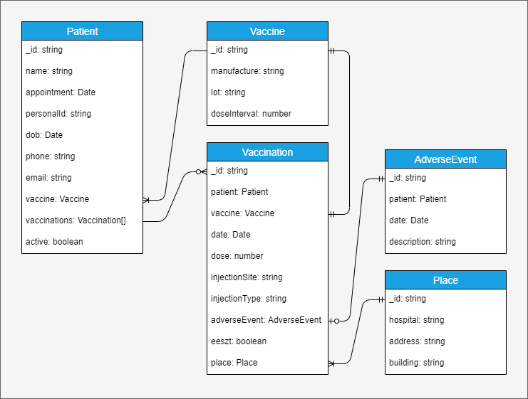

# Az **str-fullstack-oltopont** alkalmazás dokumentációja

## Az alkalmazás célja

Az alkalmazás egy kórházi oltópont adminisztrációs felületét valósítja meg. A felhasználó bejelentkezését követően felhasználó szerepkörétől függően lehetővé válik az oltásra váró páciensek adatainak kezelése: páciensek listájának megjelenítése, új páciens adatainak felvétele és módosítása. További feladata a vakcinák, oltási események, oltási szövődmények, és az oltás helyszínek adatainak kezelése (táblázatos megjelenítés, szerkesztés, új adat létrehozása).

## Az alkalmazásban felhasznált keretrendszerek

### Backend

- Node.js
- Express
- JSON Web Tokens
- MongoDB (Atlas)
- Jest

### Frontend

- Angular
- Bootstrap
- Font Awesome

## Az [str-fullstack-oltopont](https://github.com/petert360/str-fullstack-oltopont "GitHub Repository") repository helyi másolat (clone) készítése

`git clone https://github.com/petert360/str-fullstack-oltopont.git`

## Az alkalmazás telepítése fejlesztői (developer) üzemmódban

A backend oldal és függőségeinek telepítése:

- A `/backend` mappában a Visual Studio Code indítása: `code .`
- A terminal ablakban a gyökér mappában kell futtatni az `npm i` parancsot.
- Backend indító script: `npm start`

A frontend oldal és függőségeinek telepítése:

- A `/frontend` mappában a Visual Studio Code indítása: `code .`
- A terminal ablakban a gyökér mappában kell futtatni az `npm i` parancsot.
- Frontend indító script: `npm start`

## Az alkalmazás telepítése felhasználói (production) üzemmódban

- A frontend oldal és függőségeinek telepítéséhez a terminal alkalmazásban a `/frontend` mappában a kell futtatni az `npm i` parancsot.

- A fontend build elkészítése: `ng build`

- A `/frontend/dist/frontend` mappa tartalmát át kell másolni a `/backend/public` mappába.

## Az alkalmazás telepítése Docker konténer használatával

 1. Docker konténer felépítése (a `/backend` mappából indítva):  
  `docker build -t vizsgaremek-oltopont:latest .`  
  (npm script: `npm docker-build`)

 2. Docker konténer futtatása (a `/backend` mappából indítva):  
  `docker run -p 3000:3000 vizsgaremek-oltopont`  
  (npm script: `mpm docker-run`)
  
## Az alkalmazás telepítése Docker Compose segítségével
  
Docker konténer felépítése és futtatása: a `/backend` mappából (amennyiben a backend konténerhez csatolt lokális MongoDB adatbázis szeretnénk használni).

- `docker-compose up`  
 (npm script: `npm docker-compose-up`)

## Belépés az alkalmazásba

Az alkalmazás böngészőből, a telepített számítógép 3000-es portján érhető el.

Például: <http://localhost:3000/>

Az alkalmazásba történő belépéséhez használható e-mail cím és jelszó párosok:

| E-mail          | Jelszó |
| :----:          | :----: |
| admin@gmail.com | admin  |
| orvos@gmail.com | orvos  |
| nover@gmail.com | nover  |

## Az alkalmazás konfigurálása

A `base.service.ts` állományban meg kell adni az API végpont elérési útvonalát.

## Entitások diagram

Az alkalmazásban használt entitások entitás-kapcsolat diagramja:

## A backend végpontok dokumentációja

A végpontok dokumentációja Swagger segítségével történt, elérése a backend oldalon az alábbi végponton:

`/api-docs`

## Linkek

[Oltópont alkalmazás user story](https://github.com/petert360/str-fullstack-oltopont/blob/main/README.md)
